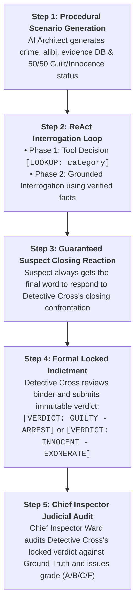

# 🕵️ Multi-Agent Detective Interrogation System: User Guide & Theme Menu

This guide explains how to run the multi-agent investigation system, choose custom themes, and adjust budget parameters.

---

## 🚀 Quick Start Commands

### 1. Run with a Random Theme (Default)
```bash
python ping_pong.py
```

### 2. Run with Specific Preset Themes
| Theme Keyword | Command | Setting / Scenario Description |
| :--- | :--- | :--- |
| **`hamar`** | `python ping_pong.py --theme hamar` | 🎓 University of Hamar exam & research fraud |
| **`oslo`** | `python ping_pong.py --theme oslo` | 🎭 High-end art & diamond heist at the Oslo Opera House |
| **`forest`** | `python ping_pong.py --theme forest` | 🌲 Dark Nordic forest cabin murder mystery |
| **`1900s`** | `python ping_pong.py --theme 1900s` | 🕰️ 1900s Victorian & industrial era detective noir |
| **`ring`** | `python ping_pong.py --theme ring` | 💍 Ultra-rich elite diamond ring investment fraud |
| **`dog`** | `python ping_pong.py --theme dog` | 🐕 Champion pedigree show dog kidnapping & ransom |
| **`f1`** | `python ping_pong.py --theme f1` | 🏎️ Formula 1 Monaco paddock telemetry theft |
| **`cyberpunk`**| `python ping_pong.py --theme cyberpunk`| 🤖 Neo-Tokyo corporate data server infiltration |
| **`space`** | `python ping_pong.py --theme space` | 🚀 Mars orbital station oxygen sabotage |
| **`casino`** | `python ping_pong.py --theme casino` | 🎲 Las Vegas Strip vault laser robbery |
| **`svalbard`**| `python ping_pong.py --theme svalbard` | ❄️ Arctic research seed vault sample tampering |
| **`sub`** | `python ping_pong.py --theme sub` | 🌊 Luxury submarine expedition poisoning |

---

### 3. Run with ANY Custom Free-Form Prompt (Pop Culture, Sci-Fi, etc.)
You can pass any freeform setting, character, or crime in quotes:
```bash
python ping_pong.py --theme "Rick and Morty, Rick accused of killing Morty in the garage"
python ping_pong.py --theme "Bank vault gold robbery in Bergen"
python ping_pong.py --theme "Medieval castle crown jewel theft"
python ping_pong.py --theme "Silicon Valley quantum computing sabotage"
```

---

## 🎭 Case Dynamics: Guilty Suspects vs. Innocent Framed Witnesses

The system randomly generates either a **Guilty Perpetrator** or an **Innocent Framed Witness**:

* **Guilty Perpetrator (Default 50% chance or `--guilty`):**
  The suspect committed the crime and lied in their alibi. Detective Cross must gather evidence and extract a confession.
* **Innocent Framed Witness (Default 50% chance or `--innocent`):**
  The suspect did NOT commit the crime. The database contains **exonerating evidence**. Detective Cross must deduce their innocence and declare them **cleared of suspicion**. If Cross bullies an innocent suspect, the Chief Inspector issues a **Grade F (False Conviction)**!

### Force Specific Scenarios:
```bash
# Force an innocent framed witness case in Hamar:
python ping_pong.py --theme hamar --innocent

# Force a guilty perpetrator case in Oslo:
python ping_pong.py --theme oslo --guilty

# Force Rick & Morty innocent case:
python ping_pong.py --theme "Rick and Morty garage murder" --innocent
```

---

## ⚙️ Available Command-Line Arguments

| Flag | Type | Default | Description |
| :--- | :--- | :--- | :--- |
| `--theme` | `str` | `None` (Random) | Keyword for preset theme or any custom scenario string |
| `--innocent` | `flag` | `False` | Force the suspect to be an innocent framed witness |
| `--guilty` | `flag` | `False` | Force the suspect to be the guilty perpetrator |
| `--turns` | `int` | `10` | Hard cap on total interrogation turns |
| `--mock` | `flag` | `False` | Fast offline test (does not save log files to disk) |


### Example: Running a Long 14-Turn Investigation in Oslo
```bash
python ping_pong.py --theme oslo --turns 14
```

---

---

## 🔄 The 5-Step Interrogation Lifecycle



---

## 📁 Output Log Files

Every live run of `ping_pong.py` automatically saves a complete case report to the `transcripts/` directory named with the timestamp and case theme:
```text
transcripts/YYYY-MM-DD_HH-MM-SS_<Case_Title>.txt
```

Each log file includes:
1. **Metadata & Ground Truth Solution Key** (Suspect status: Guilty or Innocent, plus true evidence facts)
2. **Available Database Records** (Full evidence index)
3. **Turn-by-Turn Interrogation Transcript** (With database dispatches and suspect closing response)
4. **Detective Cross Final Locked Verdict** (Official indictment submitted before judge review)
5. **Chief Inspector Final Verdict & Judicial Audit** (Grade and reasoning)
6. **Budget Metrics** (Turns, tokens, wall-clock duration, and termination reason)

---

## 📊 High-Volume Empirical Benchmark Suite (`benchmark_suite.py`)

If you want to run high-volume experiments without saving individual chat logs to collect statistics and percentage tables across turn limits and temperatures:

### Commands:
```bash
# 1. Run 10 live benchmark interrogations:
python benchmark_suite.py --runs 10

# 2. Run a full parametric grid sweep (Turns 4, 6, 8, 10 x Temperatures x Guilt):
python benchmark_suite.py --grid

# 3. Fast offline mock test (30 runs in seconds):
python benchmark_suite.py --mock --runs 30
```

### Outputs Generated:
* **Live Terminal Summary Table** (Judicial Accuracy, Conviction Rate, Escape Rate, Exoneration Rate, Token efficiency).
* **`benchmark_results.csv`**: Raw CSV dataset of every single iteration (suitable for plotting in pandas/seaborn).
* **`benchmark_summary.md`**: Formatted Markdown report with executive summary and confusion matrix tables.


